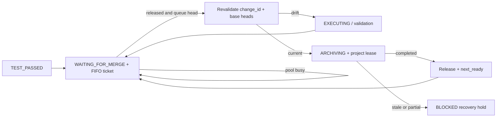

# Plan - Project-scoped Archive Queue Resume

## Workflow Information

- Repo: `D:\project\my-ai-skills`
- Branch: `fix/archive-project-queue-resume`
- Base: `main` at `383738bd9bb93849ad28eeb9c20b8508040589fe`
- Project Root: `D:\project\my-ai-skills`
- Docs Root: `D:\project\my-ai-skills\worktrees\archive-project-queue-resume\docs`
- Code Repos: `D:\project\my-ai-skills`
- Worktree: `D:\project\my-ai-skills\worktrees\archive-project-queue-resume`
- Current Stage: `$m-plan`; awaiting explicit approval before implementation

## Stage Records

### Initialization

- `guide.md`: read; every modification must be committed automatically with an English commit message following repository history.
- Project/docs/code repo confirmation: one Git repository owns skill source, runtime, tests, and governed docs; repository-local `docs` is the selected docs root.
- Base/worktree confirmation: clean `main`; dedicated branch and worktree created under the project `worktrees` directory.
- Main repo boundary: the main checkout remains the control plane; all planning and later implementation writes use the dedicated worktree.

### Discuss - Discovery And Requirements Shaping

#### Goal

Make archive contention safe and self-continuing without reducing concurrency between independent projects.

#### Scope

- project-scoped archive/integration FIFO admission;
- automatic continuation after normal lease release;
- archive eligibility revalidation after tests and while waiting;
- separation of archive capacity from optional Tester host capacity;
- Windows/Linux-compatible local runtime behavior;
- skill, stable-doc, runtime, and focused-test alignment.

#### Assumptions

- `project_root + project_id` remains the archive scheduling boundary for schema version 2; schema version 1 retains its current Git-common-directory-compatible runtime identity.
- Independent projects do not share a writable control-plane repository, target base branch, or governed docs root. If those resources overlap, they are not conflict-free projects for archive purposes.
- Host task/thread messaging is available when automatic wakeup is used. The runtime exposes durable readiness; the host layer delivers the wakeup.
- Standalone `$m-archive` remains backward compatible and does not silently create a machine-wide scheduler.

#### Open Questions

- None blocking.
- A real Linux runner is not currently confirmed. Portable tests will be added and run on the current Windows host; Linux execution remains a validation item for `$m-test` or an available CI/host runner.

#### Options Considered

1. Busy-wait inside every waiting Worker.
   - Rejected because it wastes task capacity, creates long silent waits, and is fragile across host interruptions.
2. Machine-wide archive lock keyed by physical repositories/docs roots.
   - Rejected because the user confirmed that independent projects are parallel and non-conflicting; a global lock would over-serialize them.
3. Reuse the existing per-project capacity-one merge pool, add durable readiness/wakeup, and enforce archive-specific eligibility.
   - Selected because it preserves established project isolation, FIFO state, phase ownership, and standard-library runtime behavior.

#### Recommended Direction

Strengthen the existing project-local merge pool rather than adding a new global archive service. Keep `WAITING_FOR_MERGE` as a durable non-blocking queue state. On normal archive lease release, compute the next eligible same-project queue head and expose its Worker callback for host wakeup. Project status must expose the same readiness so the Planner can recover a missed wakeup.

Before a merge lease becomes durable, revalidate the Task's tested worktree identifier and recorded repository base heads. Drift returns the Task to execution/validation, removes its stale merge ticket, and consumes no archive or host permit. Archive acquisition never touches the optional Tester host budget.

#### Research Summary

- No web research used. The design is based on repository contracts, runtime inspection, existing tests, and two temporary reproductions performed during discussion.

#### Worktree / Branch / Docs Root Status

- Project root: confirmed.
- Docs root: confirmed in the dedicated worktree.
- Code repo: confirmed.
- Branch/worktree: ready.

#### Issue List

- No planning blocker.

### Plan - Requirements And Architecture

#### Discussion Summary

The confirmed concurrency boundary is the project, not the host. Same-project archive Tasks serialize in FIFO order; different projects retain independent runtime roots and may archive concurrently. Normal contention is a waiting condition. Stale ownership, partial multi-repository integration, and ambiguous recovery remain explicit blockers.

#### Accepted / Rejected Requirements

- Accepted: same-project capacity one, FIFO waiting, automatic same-project continuation, drift revalidation, Windows/Linux portability, and no Tester host permit during archive.
- Accepted: project status provides durable reconciliation when a wakeup message is lost.
- Accepted: existing queued/runtime records remain readable through additive state fields and output fields.
- Rejected: machine-wide archive capacity, cross-project wakeups, automatic stale lease stealing, and platform-specific file-lock APIs.
- Deferred: remote/multi-machine archive coordination.

#### Requirements Analysis

##### Goal

Guarantee that an archive Task waiting behind another Task in the same project can resume safely after capacity is released, without archiving unvalidated drift or affecting other projects.

##### Scope

- `m-orchestrator` project merge pool and Task state;
- `m-archive` orchestrated-entry contract;
- project feature, requirements, specification, architecture decision, and lease-recovery guidance;
- focused cross-process runtime and contract tests;
- installed skill synchronization after validation.

##### Use Cases

1. Two passed Tasks in one project queue for archive. The first archives; the second remains `WAITING_FOR_MERGE`, is exposed as ready after release, and resumes through its existing Worker.
2. Two projects archive concurrently. Each obtains its own capacity-one project lease even when the machine-level Tester budget is fully occupied or configured to one.
3. A waiting Task's worktree changes. Archive acquisition returns it to execution/validation without creating a lease.
4. A preceding archive advances a participating repository base. The next Task is woken, detects base drift, revalidates, and then requeues.
5. A wakeup message is lost. Project status still reports the free merge pool and ready FIFO head so the Planner can resend the continuation.
6. An archive owner becomes stale or leaves partial integration. Capacity is not silently handed to unrelated work until explicit project recovery resolves the integration state.

##### Functional Requirements

- Keep one durable FIFO queue and capacity-one archive lease set per project runtime root.
- Keep waiting Tasks in `WAITING_FOR_MERGE`; do not use `BLOCKED` for ordinary capacity or FIFO waits.
- Persist the archive candidate identity needed to compare tested worktree state and repository base heads.
- Revalidate archive candidate state at merge enqueue and immediately before lease creation.
- On drift, atomically remove the stale ticket, return the Task to `EXECUTING` with an actionable reason/evidence record, clear invalid gate/change state, and return structured `NeedsRevalidation` output.
- On ordinary capacity/FIFO contention, return structured `Waiting` output without holding project or host capacity.
- On normal archive release after persisted completion, return the next same-project ready Task and Worker callback metadata.
- Expose the same ready head in project status for lost-wakeup reconciliation.
- Restrict optional host-budget acquisition, heartbeat, and release to the configured Tester pool. Newly created archive leases must have no host lease.
- Preserve exact lease ownership, idempotent enqueue/release, explicit stale reclaim, and compare-and-set Task transitions.
- Prevent abnormal/stale/partial archive release from advertising unrelated queued work as ready until the project recovery decision is recorded.
- Preserve schema version 1 interfaces and schema version 2 manifest behavior. Existing records without new archive-candidate fields must fail safe into revalidation rather than being treated as current.

##### Non-functional Requirements

- Use Python standard library only.
- Continue using short atomic directory locks solely for local metadata critical sections and JSON temp-file plus `os.replace` state writes.
- Do not use `fcntl`, `flock`, `msvcrt.locking`, named mutexes, `inotify`, or Windows-only watchers.
- Avoid busy waiting and unbounded blocking inside the runtime CLI.
- Keep status and queue operations scoped to the selected project runtime; never scan unrelated project roots.
- Keep new JSON/output fields additive where possible and provide actionable compatibility errors or revalidation results.
- Tests must use subprocess or otherwise genuine cross-process entry points for filesystem-lock behavior and must not depend on `fork` semantics.

##### Inputs / Outputs

- Inputs: validated project config, Task state, merge queue ticket, test/gate evidence, current worktree composite identifier, current configured base refs, exact lease owner IDs.
- `pool enqueue`: `Queued` or `NeedsRevalidation` for merge eligibility.
- `pool try-acquire`: `Acquired`, `Waiting`, `NeedsRevalidation`, or recovery `Blocked`.
- `pool release`: existing release status plus optional `next_ready` for the same project.
- `project status`: existing state plus per-pool readiness/recovery information.
- Host action: a follow-up message to the persisted Worker callback containing the exact Task ID and instruction to retry archive admission; this message is a wakeup, not proof of acquisition.

##### Edge Cases

- Duplicate enqueue, wakeup, acquisition, heartbeat, and release calls.
- Queue head changes while another process reads project status.
- Worktree or root plan changes after `TEST_PASSED`.
- Base branch advances while the Task waits or while tests run.
- Existing merge ticket has no archive-candidate metadata after upgrade.
- Existing archive lease still contains a legacy host lease ID; release must clean it safely while new archive leases never acquire one.
- Queue owner Task is missing, in the wrong state, or bound to no live Worker.
- Archive completes but wakeup delivery fails.
- Archive is reclaimed or partially integrates a multi-repository Task.
- Windows path/case behavior and Linux case-sensitive paths.

##### Acceptance Criteria

- Same-project merge capacity never exceeds one and FIFO order is preserved.
- Normal release makes exactly the next eligible same-project Task discoverable and retryable.
- Separate project runtime roots can hold archive leases concurrently.
- Archive acquisition never consumes the Tester host budget.
- Worktree or base drift after validation cannot enter `ARCHIVING`.
- Drift produces an actionable revalidation state rather than a permanent capacity blocker.
- Lost wakeups remain recoverable from persisted project status.
- Stale/partial archive recovery remains explicit and does not wake unrelated queued work prematurely.
- Existing orchestrator tests and schema version 1 compatibility continue to pass.
- Source, distribution, and installed skill copies match after validation/sync.

##### Risks

- Returning drifted Tasks to the queue tail can cause repeated validation churn when integration traffic is continuous; the first version favors correctness and simple FIFO semantics over priority retention.
- Wakeup delivery depends on host task/thread tools. Durable ready status is the recovery mechanism when direct delivery fails.
- A real Linux runner may not be available in the execution environment; portable subprocess tests reduce but do not eliminate that residual risk.
- Existing active runtime records require additive compatibility handling and must not be silently migrated while leases are active.

#### Architecture Design

##### Overall Solution

Keep the current project-local pool directories and capacity-one merge configuration. Extend Task state with an additive archive-candidate snapshot and extend merge-pool results with readiness/revalidation information.

The runtime remains a local deterministic state machine. It never calls host messaging APIs. Instead, release/status output identifies the same-project Worker that should be resumed. `$m-orchestrator` owns delivery through host tools, while `$m-archive` remains the authority once an active merge lease exists.



##### Alternatives Considered

- Long-running blocking `wait-acquire`: rejected because the runtime contract is intentionally non-blocking and Planner availability must be preserved.
- Global resource/fencing service: rejected because projects are the confirmed non-conflicting scheduling boundary and the repository already owns isolated project runtimes.
- Rely only on Git's index lock: rejected because it does not protect tested-state validity, docs/archive sequencing, queue state, or automatic continuation.

##### Module Responsibilities

- `orchestrator_runtime.py`: project-local queue/lease mutation, archive-candidate snapshot/revalidation, ready-head reporting, host-budget separation, compatibility, and structured results.
- `m-orchestrator` skill/references: when to queue, wait, retry, wake the owning Worker, reconcile lost wakeups, rerun validation, and recover abnormal archive state.
- `m-archive` skill/references: require a valid active integration lease when invoked through orchestrator; do not redefine project scheduling or standalone semantics.
- Stable docs: make project-local serialization, cross-project parallelism, cross-platform constraints, and wake/revalidation behavior durable.
- Tests: prove state, capacity, isolation, wake readiness, drift handling, compatibility, and portable cross-process locking.

##### Data / Call Flow

1. Test success or justified test skip records an archive-candidate snapshot containing the current composite change identifier/evidence and configured repository base heads.
2. The Worker transitions to `WAITING_FOR_MERGE` and enqueues idempotently.
3. `try-acquire` checks project FIFO/capacity, then revalidates archive candidate state under the project-pool critical section.
4. Drift removes the stale ticket and returns the Task to execution; current state creates the project archive lease and transitions to `ARCHIVING`.
5. `$m-archive` persists completion/blocker evidence before lease release.
6. Normal release removes the lease and returns the next ready same-project Task plus its Worker callback.
7. The host layer sends a follow-up; project status exposes identical readiness if the message is lost.

##### Interface Drafts

- Additive Task field:

  ```json
  {
    "archive_candidate": {
      "change_id": "...",
      "base_heads": {"repository-id": "commit"},
      "captured_at": "...",
      "source": "test-passed | justified-skip"
    }
  }
  ```

- Merge acquisition drift result:

  ```json
  {
    "status": "NeedsRevalidation",
    "task_id": "T-1",
    "reason": "worktree-drift | base-drift | missing-archive-candidate",
    "state": "EXECUTING"
  }
  ```

- Normal release/status readiness:

  ```json
  {
    "next_ready": {
      "task_id": "T-2",
      "thread_id": "worker-thread",
      "host_id": "local",
      "position": 1
    }
  }
  ```

  The runtime output is untrusted status data and does not itself invoke or authorize host actions.

##### Error Handling and Safety

- Wrong-owner, malformed lease, state mismatch, corrupt record, and unsafe paths remain explicit errors.
- Ordinary queue contention returns `Waiting`, not an exception or `BLOCKED` transition.
- Drift returns `NeedsRevalidation` and consumes no capacity.
- Stale leases remain diagnostic until explicit reclaim.
- Partial archive/reclaim does not advertise the next unrelated Task as ready while project integration recovery is unresolved.
- All Task mutations preserve expected-state compare-and-set behavior.

##### Performance and Testing Strategy

- Queue/status work remains linear in one selected project's Tasks and pool records.
- No cross-project scan or host-wide archive lock is added.
- Use focused unit tests for snapshots/state transitions and CLI subprocess tests for real process contention.
- Run full unittest discovery, skill validation, diff checks, and source/dist/installed parity.

##### Extensibility Design Points

- Additive ready/revalidation fields can later support a host-native event subscription without changing the pool ownership model.
- A future explicit integration-recovery command can extend the recovery hold contract without weakening normal FIFO release.
- Remote/multi-machine coordination remains a separate design because local filesystem leases are intentionally host-local.

#### Issue List

- No architecture blocker.
- Linux execution evidence may require a later `$m-test` environment or CI runner; absence must be reported rather than converted into a pass.

### Stage 3.1 - Planning

#### Project Goal and Current State

The repository already provides project-isolated queues and capacity-one archive admission, but normal release does not expose/wake the next waiting Worker, merge acquisition does not revalidate post-test drift, and archive currently consumes optional Tester host capacity. The plan strengthens that existing architecture without adding global archive serialization.

#### Docs Governance Routing Decision

- Original request evidence: added to `docs/intake/2026-08-15_orchestrator-archive-queue-resume.md` and indexed.
- Current orchestrator behavior: update `docs/features/m-project-orchestrator.md` during approved execution.
- Durable requirements: update `docs/requirements/m-project-orchestrator.md` during approved execution.
- Technical contract: update `docs/specs/m-project-orchestrator.md` during approved execution.
- Architecture rationale: add `docs/decisions/2026-08-15_project-scoped-archive-resume.md` during approved execution.
- Reusable recovery guidance: clarify `docs/lessons/orchestrator-lease-recovery.md` if implementation confirms new reusable lookup guidance.
- Workflow result: create `docs/change/2026-08-15_orchestrator-archive-queue-resume.md` only in `$m-archive`.

#### Related Intake / Features / Requirements / Specs / Decisions / Lessons

- Intake: `docs/intake/2026-08-15_orchestrator-archive-queue-resume.md`
- Features: `docs/features/m-project-orchestrator.md`
- Requirements: `docs/requirements/m-project-orchestrator.md`
- Specs: `docs/specs/m-project-orchestrator.md`
- Decisions: `docs/decisions/2026-07-31_project-orchestrator.md`, `docs/decisions/2026-08-04_orchestrator-multi-repo-runtime.md`
- Lessons: `docs/lessons/orchestrator-lease-recovery.md`, `docs/lessons/orchestrator-multi-repository-runtime-boundaries.md`

#### Stable Docs Impact

- Intake impact: add
- Feature impact: clarify
- Requirements impact: clarify
- Specs impact: clarify
- Decision impact: add
- Lessons known at planning time: likely clarify `orchestrator-lease-recovery.md`; archive will reassess based on implementation/test findings

#### Executable Task List

- `ARQ-1`: align stable docs and skill contracts.
- `ARQ-2`: implement project-scoped archive eligibility, release readiness, and capacity separation.
- `ARQ-3`: add focused concurrency, drift, wakeup, compatibility, and cross-process tests.
- `ARQ-4`: validate, synchronize installed skills, review diff/state, and commit implementation.
- `ARQ-5`: run real Linux-host validation when an environment is available.
- `ARQ-6`: archive, merge, and clean the workflow after execution/testing passes.

#### Execution Scope After Approval

##### Will Execute

- `ARQ-1`
- `ARQ-2`
- `ARQ-3`
- `ARQ-4`

##### Will Not Execute Now

- `ARQ-5`: environment-dependent validation; run during `$m-test` or CI when a Linux runner is available. Absence remains an explicit residual risk.
- `ARQ-6`: owned by the later `$m-archive` phase after implementation and required validation pass.

#### Task Details

##### ARQ-1 - Align Stable Docs And Skill Contracts

- Owner: main agent using `$m-docs`; no sub-agent.
- Worktree: `D:\project\my-ai-skills\worktrees\archive-project-queue-resume`
- Plan Path: `D:\project\my-ai-skills\worktrees\archive-project-queue-resume\plan.md`
- Goal: make project-local archive FIFO/wakeup, cross-project parallelism, drift handling, host-budget separation, and Windows/Linux constraints explicit and consistent.
- Files / Modules:
  - `docs/features/m-project-orchestrator.md`
  - `docs/requirements/m-project-orchestrator.md`
  - `docs/specs/m-project-orchestrator.md`
  - `docs/decisions/2026-08-15_project-scoped-archive-resume.md`
  - affected category indexes
  - `docs/lessons/orchestrator-lease-recovery.md` when reusable guidance changes
  - `skills/m-orchestrator/SKILL.md`
  - `skills/m-orchestrator/references/{planner,worker,testing-pool,state-machine,configuration}.md`
  - `skills/m-archive/SKILL.md`
  - `skills/m-archive/references/archive.md`
- Write Set: only the listed stable docs, indexes, skill sources, and direct reference files.
- Acceptance: no contract implies global archive serialization; ordinary same-project contention is waiting; normal release resumes only the same-project queue; abnormal recovery remains explicit; archive does not use Tester host capacity; orchestrated `$m-archive` requires an active integration lease.
- Test Points: contract-text assertions and contradiction searches for global archive locks, archive host capacity, waiting-as-blocked, and missing drift revalidation.
- Rollback: revert the ARQ-1 documentation/skill-contract commit without changing runtime state.

##### ARQ-2 - Implement Project-scoped Archive Admission And Resume State

- Owner: main agent; no sub-agent.
- Worktree: `D:\project\my-ai-skills\worktrees\archive-project-queue-resume`
- Plan Path: `D:\project\my-ai-skills\worktrees\archive-project-queue-resume\plan.md`
- Goal: safely revalidate archive candidates, separate Tester host permits, and expose durable same-project next-ready state after release.
- Files / Modules:
  - `skills/m-orchestrator/scripts/orchestrator_runtime.py`
  - `skills/m-orchestrator/assets/m-orchestrator.example.toml` only if comments/contract cues require clarification; no config schema change is expected
- Write Set: orchestrator runtime and, only if needed, its example configuration.
- Acceptance:
  - merge enqueue/acquire verifies worktree candidate and base heads;
  - drift consumes no lease and returns the Task to execution with structured output;
  - merge acquisition never creates a host Tester lease;
  - release/status exposes only the next eligible same-project Task;
  - separate projects remain independent;
  - existing records and active legacy leases are handled safely;
  - abnormal archive recovery does not prematurely wake unrelated work.
- Test Points: focused helper/state tests in ARQ-3 plus manual JSON/CLI review for additive output compatibility.
- Rollback: revert the runtime commit; additive Task/output fields require no destructive migration. Preserve any active runtime directory and inspect leases before rollback.

##### ARQ-3 - Add Concurrency And Cross-platform Regression Coverage

- Owner: main agent; no sub-agent.
- Worktree: `D:\project\my-ai-skills\worktrees\archive-project-queue-resume`
- Plan Path: `D:\project\my-ai-skills\worktrees\archive-project-queue-resume\plan.md`
- Goal: prove same-project FIFO continuation, cross-project parallelism, drift rejection, host-budget separation, idempotency, and portable process-level locking.
- Files / Modules:
  - `tests/test_m_orchestrator_runtime.py`
  - `tests/test_m_orchestrator_contract.py`
  - optional new focused test module only if it materially improves isolation/readability
- Write Set: focused orchestrator tests only.
- Acceptance:
  - two same-project archive Tasks serialize and the second becomes ready/acquires after release;
  - two independent projects acquire archive leases concurrently even with Tester host budget capacity one;
  - worktree and base drift after validation produce `NeedsRevalidation`;
  - normal release and project status identify the same FIFO head;
  - stale/partial release does not wake unrelated work;
  - repeated wake/release/acquire remains owner-safe and idempotent;
  - at least one CLI subprocess contention test avoids thread-only or `fork`-only assumptions.
- Test Points: focused unittest discovery for runtime/contract modules on Windows; test code must run unchanged under Linux Python.
- Rollback: revert test additions independently if the runtime change is also reverted.

##### ARQ-4 - Validate, Sync, And Commit Implementation

- Owner: main agent; no sub-agent.
- Worktree: `D:\project\my-ai-skills\worktrees\archive-project-queue-resume`
- Plan Path: `D:\project\my-ai-skills\worktrees\archive-project-queue-resume\plan.md`
- Goal: complete proportional validation, synchronize installed packages, verify parity, and create English commits required by `guide.md`.
- Files / Modules:
  - `tools/validate-skills.ps1`
  - `tools/sync-skills.ps1`
  - Git status/diff/commit history
  - installed `m-orchestrator` and `m-archive` skill copies outside the repo as generated sync targets
- Write Set: no new product source beyond ARQ-1 through ARQ-3; installed skill copies are updated only after source validation passes.
- Acceptance:
  - focused runtime and contract tests pass;
  - full `python -m unittest discover -s tests -v` passes;
  - `tools/validate-skills.ps1 -Skill m-orchestrator` and `-Skill m-archive` pass;
  - `git diff --check` passes;
  - installed skill sync completes and source/dist/installed parity is verified according to repository tools;
  - unrelated dirt remains untouched;
  - English commits follow repository history.
- Test Points: command exit status, structured test results, post-sync status/parity, and final diff review.
- Rollback: restore installed skills by syncing from the reverted source; revert implementation commits in reverse order.

##### ARQ-5 - Validate On A Real Linux Host

- Owner: `$m-test` or CI/Linux operator.
- Worktree: the same approved branch/worktree or an exact checkout of its commit.
- Plan Path: this file.
- Goal: execute the portable runtime and subprocess concurrency suite on Linux rather than inferring portability from Windows alone.
- Files / Modules: no planned source changes; validation evidence only unless a Linux-specific defect is found and returned to `$m-execute`.
- Write Set: none in the next execution phase.
- Acceptance: focused and full tests pass on Linux; failures return to ARQ-2/ARQ-3 repair.
- Test Points: Python version, filesystem type, focused runtime tests, full discovery, and skill validation where PowerShell is available.
- Rollback: not applicable to validation-only work.

##### ARQ-6 - Archive And Close The Workflow

- Owner: `$m-archive` after execution and required testing.
- Worktree: control-plane merge after archive readiness.
- Plan Path: this file, later retained under `docs/plan` when project rules require it.
- Goal: create the governed change archive, reassess lessons, merge the branch, and clean the worktree according to the updated archive contract.
- Files / Modules: `docs/change`, optional `docs/lessons`, affected indexes, Git control plane.
- Write Set: none in the next execution phase.
- Acceptance: archive evidence maps ARQ-1 through ARQ-4, records ARQ-5 status/residual risk, and completes or explicitly blocks merge/cleanup.
- Test Points: archive entry gate and final repository/worktree state.
- Rollback: owned by `$m-archive` and recorded in the change archive.

#### Dependencies

- `ARQ-1` establishes the durable contract before runtime behavior changes.
- `ARQ-2` implements that contract.
- `ARQ-3` validates ARQ-2 and guards ARQ-1 wording.
- `ARQ-4` depends on ARQ-1 through ARQ-3.
- `ARQ-5` depends on the exact validated ARQ-4 commit and occurs outside the next execution phase unless a Linux runner becomes available.
- `ARQ-6` depends on execution completion and the applicable `$m-test`/residual-risk decision.

#### Risks and Notes

- The host wakeup is deliberately outside the standard-library runtime; runtime readiness must remain durable so the Planner can recover a missed message.
- Queue fairness after drift uses a fresh validated enqueue. Retaining priority while a Task is invalid could create head-of-line blocking and is rejected for the first version.
- Project-level concurrency assumes projects are operationally non-conflicting. Shared writable integration resources require one project/conflict domain or a separately approved architecture.
- No remotes, push, publication, deployment, or backup targets are added or inferred.

#### Parallelism Assessment

- Implementation will be performed sequentially by the main agent because stable contracts, one runtime module, and its focused tests are tightly coupled.
- No implementation sub-agents are authorized or planned.
- Runtime acceptance explicitly preserves parallel archive execution across independent project runtime roots while serializing each individual project's merge pool.

#### Issue List

- Blocked: no for planning.
- Implementation authorization: pending explicit user approval of `ARQ-1` through `ARQ-4`.
