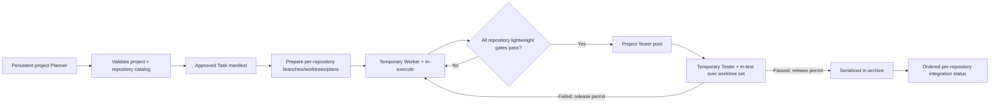

# Plan - m-orchestrator Multi-repository Support

## Workflow Information

- Repo: `D:\project\my-ai-skills`
- Branch: `fix/orchestrator-multi-repo`
- Base: `main` at `d39b134747d64df7979704c7ac2ca38f09fb8611`
- Project Root: `D:\project\my-ai-skills`
- Docs Root: `D:\project\my-ai-skills\worktrees\orchestrator-multi-repo\docs`
- Code Repos: `D:\project\my-ai-skills`
- Worktree: `D:\project\my-ai-skills\worktrees\orchestrator-multi-repo`
- Read-only acceptance example: `D:\project\monkeys`
- Current Stage: `3.3 - Heavy Validation`
- Planning Status: confirmed by the user on 2026-08-04 for MRO-1 through MRO-7

## Stage Records

### Initialization

- `guide.md`: read; repository changes require focused validation and an English auto-commit.
- Project/docs/code repo confirmation: this skill change belongs to `D:\project\my-ai-skills`; `D:\project\monkeys` is evidence only and is outside the write set.
- Base/worktree confirmation: dedicated branch and worktree created from clean `main` at the commit recorded above.
- Git boundary finding: the `monkeys` umbrella root is intentionally not a Git repository; its `repo` directory contains multiple independent Git repositories.

### Discuss - Discovery And Requirements Shaping

#### Goal

Make `$m-orchestrator` implement the multi-repository model already defined by the rest of the `m-*` workflow, without requiring an umbrella project directory to be a Git repository.

#### Scope

- Correct project configuration, runtime identity, task manifests, Worker dispatch, gate evidence, Tester handoff, and archive coordination for one or many participating repositories.
- Preserve the existing `m-*` phase authorities and the existing single-repository orchestrator behavior.
- Produce actionable validation errors that identify the invalid declared repository instead of suggesting `git init` in the umbrella root.

#### Assumptions

- `project_root` is the local umbrella directory.
- `docs_root` is governed independently and may be a directory or a separate Git repository.
- Only declared participating repositories require Git validation.
- Each participating repository may have its own base branch and must receive its own task branch, worktree, and root plan copy or pointer governed by the existing initialization contract.
- Multi-machine scheduling and transactional cross-repository merges remain out of scope.

#### Open Questions

- None blocking. The user has already confirmed the umbrella/multiple-child-repository layout.

#### Options Considered

1. Initialize Git at the umbrella root.
2. Select one child repository as the orchestrator's implicit identity repository.
3. Make the project runtime independent of any one Git repository and declare participating repositories explicitly.

#### Rejected Options

- Umbrella `git init`: rejected because it invents a repository boundary, conflicts with the established `project_root` / `code_repos` model, and risks accidentally tracking child repositories and project-local runtime data.
- Implicit identity repository: rejected because tasks may span any subset of child repositories, base branches may differ, and deleting or relocating the selected child would incorrectly change project identity.
- Silent recursive repository discovery: rejected as the source of truth because directories such as dependencies, caches, and nested tooling may contain unrelated Git metadata. Discovery may be a future read-only helper, but persisted configuration must be explicit.

#### Recommended Direction

Introduce a backward-compatible schema version 2 with an explicit repository catalog, a project-local runtime root, and task-scoped repository/worktree manifests. Keep schema version 1 as a single-repository compatibility adapter when the project root itself is a valid Git repository.

#### Research Summary

Local inspection established that the wider `m-*` family already distinguishes `project_root`, `docs_root`, `code_repos`, and per-repository worktrees. The incompatibility is localized to `m-orchestrator` schema version 1 and its runtime helper, which currently calls `git rev-parse --git-common-dir` against `project_root`, stores one project-level `base_branch`, and records only one plan path per Task.

The `monkeys` example has at least fifteen valid child Git repositories under `D:\project\monkeys\repo` while the umbrella root is not a repository. Its empty `.git` directory must be ignored; only configured child repository paths are relevant.

#### Worktree / Branch / Docs Root Status

- Dedicated planning worktree: ready.
- Planning branch: ready.
- Governed docs root: ready.
- Target project adoption: deferred; this workflow will not edit `D:\project\monkeys`.

#### Issue List

- No requirements blocker.
- MRO-1 through MRO-7 were approved by the user on 2026-08-04.

### Plan - Requirements And Architecture

#### Discussion Summary

The orchestrator is an automation layer over existing phase skills. It should register one persistent project Planner independently of Git, create temporary Workers for approved Tasks, require `$m-execute` lightweight checks before temporary Tester admission, and use the existing `$m-test` and `$m-archive` authorities over the exact participating repository worktrees.

#### Accepted / Rejected Requirements

Accepted:

- A non-Git umbrella project root is valid.
- One project may declare multiple independent Git repositories.
- Each repository has an explicit stable ID, path, and base branch.
- A Task selects an exact non-empty subset of configured repositories and persists their branch/worktree/plan/ref identities before dispatch.
- Project Planner, queues, leases, contexts, environment namespace, and archive admission remain shared at project scope.
- Git validation, lightweight evidence, and archive operations are evaluated per participating repository and summarized at Task scope.
- Existing schema version 1 single-repository projects remain usable without state relocation.
- Project-specific configuration errors fail before state mutation and name the exact offending field/path.

Rejected:

- Treating the umbrella directory as an implementation repository.
- Allowing a Task to add an undeclared repository after approval.
- Letting the host's single-worktree creation primitive stand in for a multi-repository worktree set.
- Claiming atomic cross-repository integration; Git cannot provide such a transaction across independent repositories.

#### Requirements Analysis

##### Goal

Ensure multi-repository projects can validate configuration, register a Planner, dispatch approved Work, pass lightweight and heavy validation, and reach deterministic archive coordination without changing their repository topology.

##### Scope

- Schema v2 and schema v1 compatibility.
- Project runtime identity decoupled from repository Git metadata.
- Repository catalog validation.
- Task manifest, worktree-set handoff, composite change identity, and evidence rules.
- Multi-repository Worker, Tester, integration, and status contracts.
- Stable documentation, focused regression tests, packaging, installed-copy synchronization, and parity verification.

##### Use Cases

1. Register a Planner for a non-Git umbrella root containing several declared child repositories.
2. Dispatch a Task that changes one repository without preparing unrelated repositories.
3. Dispatch a Task spanning two or more repositories, each with its own branch, worktree, base ref, planning ref, and plan evidence.
4. Reject a Task naming an unknown repository or a worktree outside its allowed project worktree tree.
5. Invalidate the lightweight gate when any participating repository changes.
6. Run one temporary Tester against the complete Task worktree set while respecting project and optional host capacity.
7. Serialize archive admission and integrate each repository in a declared dependency order with explicit partial-integration reporting.
8. Continue using an existing schema v1 single-repository project and its existing Git-common-dir runtime state.

##### Functional Requirements

- Schema v2 must accept an explicit non-empty `[[repositories]]` catalog.
- Repository IDs and canonical paths must be unique.
- Relative repository paths must resolve within `project_root`, contain no traversal, and point to valid Git worktrees/repositories.
- Each repository must declare its own `base_branch`; configuration validation must resolve its Git common directory and verify the configured base ref when required for dispatch.
- Project runtime state for schema v2 must resolve under `<project_root>/.codex-runtime/m-orchestrator/projects/<project_id>` and bind metadata to the canonical project root plus configuration fingerprint.
- An empty or invalid `.git` at `project_root` must not matter for schema v2.
- Schema v1 must retain its current single-repository interpretation and runtime root, but a v1 non-Git umbrella must return a migration message to schema v2 rather than recommend `git init`.
- Task creation must consume a validated dispatch manifest containing the approved Task IDs, canonical plan evidence, participating repositories, branches, worktrees, base/planning refs, write sets, acceptance, tests, rollback, and callback metadata.
- Multi-repository Task identity must use a deterministic digest over a sorted repository snapshot; editing any participating repository invalidates previous gate evidence.
- Queue and lease semantics must remain project-scoped and must not duplicate context bodies, diffs, plans, or test output into runtime JSON.
- Project status must expose the configured repository catalog and each Task's selected repository/worktree set without scanning undeclared repositories.

##### Non-functional Requirements

- Preserve backward compatibility for valid schema v1 projects and all phase skills.
- Use standard-library runtime dependencies and deterministic Windows-safe path handling.
- Do not recursively scan the project tree during ordinary validation or status.
- Keep all mutations atomic and owner-safe under the existing project lock/lease contracts.
- Keep error messages actionable and scoped to the exact repository/configuration field.

##### Inputs / Outputs

Inputs:

- `<project_root>/.codex/m-orchestrator.toml` schema v1 or v2.
- Project-local role contexts under `<docs_root>/context`.
- Confirmed per-repository plans and dedicated worktrees.
- A Task dispatch manifest that selects configured repository IDs.

Outputs:

- Validated repository catalog and isolated project runtime root.
- Task records with exact repository/worktree/ref/plan evidence.
- Composite lightweight-gate identity and Tester package.
- Per-repository integration status plus overall project Task status.

##### Edge Cases

- Empty `.git` at the umbrella root.
- Duplicate repository IDs, canonical aliases, nested paths, traversal, external paths, missing Git metadata, missing base refs, and detached worktrees.
- Same `project_id` under two different umbrella roots.
- Two logical projects under one umbrella root.
- Schema v1 state with active Tasks during a requested schema v2 migration.
- Task manifest drift after approval, missing per-repository plan evidence, or a changed planning ref.
- One repository passes its gate while another fails.
- Partial cross-repository archive/integration after a later repository fails.
- Docs root outside the umbrella root or backed by a separate repository.

##### Acceptance Criteria

- A temporary non-Git umbrella fixture with two or more child Git repositories validates and registers a Planner.
- An empty umbrella `.git` directory is ignored under schema v2.
- Invalid declared repositories fail with their repository ID/path; no error suggests initializing the umbrella root.
- A single-repository schema v1 fixture retains its current runtime root and passes all existing tests.
- Different umbrella roots with the same `project_id` resolve to distinct schema v2 runtime roots.
- Task records preserve an exact repository subset and reject unknown or duplicate selections.
- The composite change identifier changes when any selected repository changes.
- Tester FIFO/capacity, lease recovery, and host-budget tests remain passing.
- Orchestrator/phase contract tests confirm `$m-execute` lightweight checks precede `$m-test`, and `$m-archive` remains the integration authority.
- Source, distribution, and installed skill copies match after validation and sync.

##### Risks

- Schema migration may orphan active v1 state if moved automatically; avoid automatic relocation and preserve v1 runtime behavior.
- Host task creation exposes one primary environment/worktree, not a native worktree set; prepare all repository worktrees before dispatch and pass their absolute map to one Worker hosted from the umbrella local project or an explicitly designated primary worktree.
- Cross-repository merge cannot be atomic; use complete preflight, declared order, stop-on-failure, and explicit partial-result recovery instructions.
- Canonical Windows paths can alias by case or junction; compare normalized resolved paths and reject duplicate ownership.

#### Architecture Design

##### Overall Solution

Use a versioned configuration adapter:

```toml
schema_version = 2
project_id = "monkeys"
docs_root = "docs"

[[repositories]]
id = "monkeys-server"
path = "repo/monkeys-server"
base_branch = "main"

[[repositories]]
id = "monkeys-studio"
path = "repo/monkeys-studio"
base_branch = "main"
```

Schema v2 does not have a project-level `base_branch` or `git_common_dir`. The validated in-memory project config contains a repository map whose entries hold canonical repository root, Git common directory, and base branch. Schema v1 is adapted into a single repository entry only when `project_root` is itself a valid Git repository.

Schema v2 project runtime lives at:

```text
<project_root>/.codex-runtime/m-orchestrator/projects/<project_id>/
```

The metadata records canonical `project_root`, schema version, project ID, and configuration fingerprint. The runtime must reject identity/fingerprint drift while non-terminal Tasks or leases exist. Schema v1 continues using its Git-common-dir runtime root so existing active state is not silently moved.

Task creation gains a manifest-based interface. The manifest selects configured repository IDs and records exact worktree, semantic branch, base ref, planning ref, plan evidence, write set, tests, rollback, and callback data. A compatibility CLI path may retain `--task-id --plan` for schema v1; schema v2 requires the complete manifest.

##### Alternatives Considered

- Global runtime keyed by a hash of the project path: rejected for the default because project-local state is easier to inspect, back up, and isolate. The existing global root remains host-budget-only.
- Automatically migrate v1 runtime files: rejected because active leases and worktree identities make implicit migration unsafe.
- One canonical child repository for runtime state: rejected because it recreates the original topology bug.

##### Module Responsibilities

- `orchestrator_runtime.py`: schema adapters, repository validation, runtime identity, Task manifest validation/persistence, composite Task identity inputs, status output, and existing pool/state invariants.
- `references/configuration.md`: v1/v2 contract, repository catalog, runtime isolation, and migration errors.
- `references/planner.md`: prepare and validate per-repository worktree sets; dispatch one Worker with the complete map.
- `references/worker.md`: run `$m-execute` in every selected repository, aggregate lightweight checks, and compute the composite change ID.
- `references/testing-pool.md` and `state-machine.md`: keep project-scoped permits while binding evidence to a repository set.
- Existing `$m-test`: run heavy validation across the affected cross-service flow from the provided worktree set.
- Existing `$m-archive`: remain authoritative for per-repository commits, control-plane merges, docs handling, and cleanup; orchestrator only serializes admission and records ordered outcomes.
- Stable docs: replace the false Git-common-dir project-isolation statement with the versioned project/repository model.

##### Data / Call Flow



##### Interface Drafts

- `config validate --project-root <umbrella>` returns schema version, runtime root, docs root, and normalized repository catalog.
- `task create --project-root <umbrella> --manifest <task.json>` validates and persists the exact approved worktree set.
- `project status` reports repository IDs and Task selections without reading unrelated repositories.
- Gate evidence contains `change_id`, overall status, and per-repository commit/diff/plan/check digests.
- Archive completion evidence contains one overall status and an ordered per-repository archive/merge/cleanup result.

##### Error Handling and Safety

- Validate configuration fully before `ensure_runtime` mutates the filesystem.
- Reject unknown keys, unsafe identifiers, traversal, duplicate canonical repositories, and undeclared Task repositories.
- Do not inspect or mutate umbrella `.git` under schema v2.
- Do not auto-discover and persist repositories.
- Do not auto-migrate active v1 state.
- Preserve lease owner checks and explicit stale recovery.
- Treat partial integration as `BLOCKED` with exact completed/pending repository evidence; never report it as atomic success.

##### Performance and Testing Strategy

- Add temporary umbrella fixtures containing two or three real child Git repositories.
- Parameterize existing single-repository tests across v1 compatibility and v2 one-repository configurations where useful.
- Add focused path, identity, manifest, status, composite-gate, and multi-repository contract tests.
- Retain existing concurrency, FIFO, stale-lease, owner-safety, host-budget, and success-path coverage.
- Run skill validators, focused unit modules, full unittest discovery, sync, source/dist/installed parity, representative CLI smoke tests, and `git diff --check`.

##### Extensibility Design Points

- A future read-only `config discover-repositories` helper may generate candidate entries for review, without changing explicit configuration semantics.
- External repositories outside `project_root` may be added later through a separately reviewed allowlist contract.
- Remote/multi-machine scheduling remains a separate transport problem.

#### Issue List

- No design blocker.
- No requirements or architecture blocker remains for the approved scope.

### Stage 3.1 - Planning

#### Project Goal and Current State

The existing orchestrator is functional for a single Git-root project but contradicts the established `m-autoflow` multi-repository model. The immediate failure occurs before Planner registration because the runtime resolves Git metadata from `project_root`. This plan corrects that boundary while keeping the current Worker/Tester pool behavior.

#### Docs Governance Routing Decision

- Intake: add this request and the observed `monkeys` topology during planning.
- Feature: update current project-orchestrator behavior during execution.
- Requirements: replace Git-common-dir project isolation with umbrella/repository requirements during execution.
- Specs: define schema v2, compatibility, Task manifests, runtime identity, and evidence during execution.
- Decision: add a proposed superseding decision during planning; mark relationships accepted/implemented only after execution succeeds.
- Lessons: no new lesson yet; reassess schema migration/path identity findings during archive.

#### Related Intake / Features / Requirements / Specs / Decisions / Lessons

- Intake: `docs/intake/2026-07-31_project-orchestrator.md`
- Feature: `docs/features/m-project-orchestrator.md`, `docs/features/m-autoflow-workflow.md`
- Requirements: `docs/requirements/m-project-orchestrator.md`, `docs/requirements/m-autoflow-skill.md`
- Specs: `docs/specs/m-project-orchestrator.md`, `docs/specs/m-autoflow-skill.md`
- Decisions: `docs/decisions/2026-07-31_project-orchestrator.md`
- Lessons: `docs/lessons/orchestrator-lease-recovery.md`

#### Stable Docs Impact

- Intake impact: updated with a new source-preserving record.
- Feature impact: update during MRO-1.
- Requirements impact: update during MRO-1.
- Specs impact: update during MRO-1.
- Decision impact: proposed decision added now; finalize during MRO-1/MRO-7.

#### Executable Task List

##### MRO-1 - Align Stable Documentation and Decision State

- Owner: execution agent
- Worktree: active worktree
- Plan Path: active `plan.md`
- Goal: make current feature, requirements, specs, indexes, and decision relationships describe the umbrella/repository model.
- Files / Modules: `docs/features`, `docs/requirements`, `docs/specs`, `docs/decisions`, related indexes and cross-links.
- Write Set: governed project-orchestrator and directly related autoflow stable docs.
- Acceptance: stable docs distinguish project, docs, repositories, and worktrees; no current truth requires `project_root` to be Git.
- Test Points: link checks, terminology inspection, contract tests.
- Rollback: revert only MRO-1 doc changes; keep intake as request evidence.

##### MRO-2 - Add Schema v2 Repository Catalog and v1 Adapter

- Owner: execution agent
- Worktree: active worktree
- Plan Path: active `plan.md`
- Goal: parse and validate explicit repository entries with per-repository base branches while preserving valid v1 projects.
- Files / Modules: `skills/m-orchestrator/scripts/orchestrator_runtime.py`, `references/configuration.md`, example TOML.
- Write Set: configuration data types, parsing/validation, configuration docs/assets.
- Acceptance: a non-Git umbrella with valid children passes v2; v1 Git-root behavior remains; invalid child errors are actionable.
- Test Points: schema versions, paths, aliases, IDs, Git validity, base refs, empty umbrella `.git`, v1 migration error.
- Rollback: revert schema/parser/assets changes; no runtime migration is performed.

##### MRO-3 - Decouple Project Runtime Identity from Git

- Owner: execution agent
- Worktree: active worktree
- Plan Path: active `plan.md`
- Goal: use a project-local runtime for v2 and preserve the v1 Git-common-dir runtime path.
- Files / Modules: runtime root/metadata/config/status code and configuration/state references.
- Write Set: project runtime initialization, metadata checks, status fields, directly owned tests.
- Acceptance: schema v2 Planner registration works without umbrella Git; same IDs in different roots remain isolated; active v1 state is not relocated.
- Test Points: runtime identity, fingerprint drift, two umbrellas, two logical projects, v1 compatibility.
- Rollback: revert code; any temporary test runtime fixtures are disposable and no user runtime is migrated.

##### MRO-4 - Persist Multi-repository Task and Dispatch Manifests

- Owner: execution agent
- Worktree: active worktree
- Plan Path: active `plan.md`
- Goal: validate and persist exact repository/worktree/ref/plan/write-set handoff data and composite change identity.
- Files / Modules: runtime Task creation/CLI/status, Planner/Worker/state-machine references.
- Write Set: Task manifest parser/record, CLI, status, dispatch/gate contracts.
- Acceptance: one- and multi-repository Tasks select configured repos exactly; any repository drift invalidates evidence; old v1 CLI remains supported where promised.
- Test Points: unknown/duplicate repos, unsafe worktrees, plan/ref mismatch, idempotency, manifest drift, composite digest.
- Rollback: revert Task schema/CLI changes; no production Task records are migrated automatically.

##### MRO-5 - Align Worker, Tester, Continue, and Archive Coordination

- Owner: execution agent
- Worktree: active worktree
- Plan Path: active `plan.md`
- Goal: route the complete worktree set through existing `$m-execute`, `$m-test`, `$m-continue`, and `$m-archive` authorities without duplicating their phase logic.
- Files / Modules: `m-orchestrator` role references and only the directly necessary shared `m-autoflow`/phase references.
- Write Set: orchestration/handoff wording and multi-repository evidence/closeout contracts; no unrelated phase redesign.
- Acceptance: cheap failures stay with Worker; Tester sees every participating worktree; permits release before repair; archive reports ordered per-repository outcomes and partial failure honestly.
- Test Points: contract assertions for phase ownership, repository-set propagation, gate ordering, lease lifetime, integration preflight/order/blocking.
- Rollback: revert reference changes; phase implementations remain unchanged.

##### MRO-6 - Add Multi-repository Regression and Compatibility Coverage

- Owner: execution agent
- Worktree: active worktree
- Plan Path: active `plan.md`
- Goal: prove umbrella projects work and existing pool/state behavior does not regress.
- Files / Modules: `tests/test_m_orchestrator_runtime.py`, `tests/test_m_orchestrator_contract.py`, minimal test helpers/fixtures.
- Write Set: orchestrator-focused tests only.
- Acceptance: representative umbrella fixtures pass all acceptance criteria and existing tests remain green.
- Test Points: schema/runtime/task/gate/status plus concurrency, FIFO, recovery, host budget, and full success flow.
- Rollback: remove new tests and helper fixtures.

##### MRO-7 - Validate, Sync, Smoke-test, and Commit

- Owner: execution agent
- Worktree: active worktree
- Plan Path: active `plan.md`
- Goal: run the complete repository validation/sync/parity pipeline and produce English commits.
- Files / Modules: affected source skills, generated distribution/installed copies, Git history; source fixes only when mapped to MRO-1 through MRO-6.
- Write Set: validation artifacts and synchronized copies plus mapped fixes.
- Acceptance: focused/full tests, validators, CLI smoke fixtures, sync, parity, and `git diff --check` pass.
- Test Points: source and installed skill validation; full unittest discovery; source/dist/installed SHA/parity; temporary monkeys-shaped project smoke.
- Rollback: revert workflow commits and resync restored source; do not alter user projects or unrelated installed skills.

##### MRO-X1 - Adopt Schema v2 in the Real Monkeys Project

- Owner: separate project workflow
- Worktree: not assigned
- Plan Path: not assigned
- Goal: update `D:\project\monkeys\.codex\m-orchestrator.toml` with its reviewed repository catalog and register its Planner.
- Files / Modules: real project config/runtime only.
- Write Set: outside this workflow.
- Acceptance: real config validates and Planner registration succeeds without umbrella Git.
- Test Points: read-only repository validation, context loader, project status.
- Rollback: restore the prior project config and remove only newly created v2 runtime state when no Task/lease exists.

##### MRO-X2 - Repository Autodiscovery and External Repository Allowlisting

- Owner: future planning
- Worktree: not assigned
- Plan Path: not assigned
- Goal: optionally generate reviewable repository candidates or support paths outside the umbrella.
- Files / Modules: future configuration helper/schema.
- Write Set: none now.
- Acceptance: requires a separate security and UX decision.
- Test Points: nested repos, dependencies, junctions, external paths.
- Rollback: not applicable.

#### Execution Scope After Approval

##### Will Execute

- MRO-1, MRO-2, MRO-3, MRO-4, MRO-5, MRO-6, MRO-7

##### Will Not Execute Now

- MRO-X1: separate approval/project write set after the skill fix is installed.
- MRO-X2: deferred; explicit configuration is the safe v2 source of truth.

#### Dependencies

- MRO-1 establishes stable terminology and accepted decision state.
- MRO-2 precedes MRO-3 and MRO-4.
- MRO-3 and MRO-4 must converge before MRO-5.
- MRO-6 covers MRO-2 through MRO-5.
- MRO-7 follows all implementation and test tasks.

#### Risks and Notes

- Do not mutate or initialize `D:\project\monkeys` during this workflow.
- Do not silently migrate active v1 runtime state.
- Do not claim atomic cross-repository merge semantics.
- No sub-agents are used in planning; implementation delegation may be reassessed only after plan approval and under the active host policy.

#### Parallelism Assessment

- MRO-1 docs and the initial MRO-2 parser work have separate primary write sets but share terminology; freeze the decision/schema first if delegated later.
- MRO-3 and MRO-4 share runtime data types and should be sequential or owned by one implementer.
- MRO-5 and MRO-6 can partially overlap only after manifest/evidence interfaces are stable.
- MRO-7 remains an integration task.

#### Issue List

- No blocking issue for MRO-1 through MRO-7.

## Execution Progress

| Task ID | Status | Evidence |
| --- | --- | --- |
| MRO-1 | Completed | feature, requirements, specs, and superseding decision now describe non-Git umbrella roots and explicit repository catalogs |
| MRO-2 | Completed | schema version 2 repository parser/validator plus schema version 1 compatibility adapter and migration diagnostics |
| MRO-3 | Completed | project-local v2 runtime identity, legacy active-runtime guard, canonical path checks, and project/repository status output |
| MRO-4 | Completed | validated Task manifest, exact repository/worktree/ref/plan/write-set persistence, CLI `task change-id`, and composite gate revalidation |
| MRO-5 | Completed | Planner/Worker/Tester/state/archive contracts propagate the complete worktree set while preserving existing phase authorities |
| MRO-6 | Completed | real temporary multi-repository Git fixtures cover umbrella validation, manifest safety, gate drift, CLI flow, v1 compatibility, and lease regressions |
| MRO-7 | Completed | validators, focused/full tests, sync, installed validation, parity, docs links, and diff checks passed; English execution commit prepared |

### Execution Validation

- Python syntax compilation passed for `orchestrator_runtime.py`.
- 43 orchestrator-focused runtime/contract tests passed.
- Full discovery passed 83 tests with one existing Windows symbolic-link privilege skip.
- Source validators passed for `m-orchestrator`, `m-execute`, `m-test`, `m-continue`, and `m-archive`.
- Installed validators passed for the same five skills.
- Source, distribution, and installed SHA-256 parity passed for all files in the five affected skills, excluding generated `.build-info.json` metadata.
- Affected documentation links and `git diff --check` passed.
- No files under `D:\project\monkeys` were modified and no umbrella Git repository was initialized.

Execution-stage lightweight validation passed. Heavy independent review remains owned by `$m-test`; this phase does not create `docs/change`, archive, merge, push, or clean the worktree.

### m-continue Repair Iteration 1

- Failure mapping: the host lease collision maps to MRO-3/MRO-6; manifest retry idempotency maps to MRO-4/MRO-6. No Task ID, acceptance criterion, or write-set expansion was required.
- Host ownership: new host leases use an opaque digest derived from the canonical project runtime identity and Task ID, plus an opaque project-instance digest for project-scoped inspection. Separate umbrella roots with the same `project_id` and `task_id` no longer share a lease. Exact-ID heartbeat, release, and reclaim remain compatible with legacy owner records, while new acquisition never adopts an ambiguous legacy record.
- Task retry: manifest identity is checked before creation-time worktree validation. An exact existing manifest returns its persisted Task after Worker commits, while a different manifest still fails explicitly. First-create races are rechecked under the state lock before writing.
- Regression coverage: added same-ID cross-umbrella host-capacity coverage, legacy lease continuation coverage, and exact manifest retry coverage after a Worker commit.
- Execution validation: Python compilation, `git diff --check`, 46 focused runtime/contract tests, 86 full tests with one existing Windows symbolic-link privilege skip, and the `m-orchestrator` source validator passed.
- Parallelism: no sub-agents were used because both repairs share the runtime/test write set and `$m-continue` does not grant `$m-go` worker-only delegation.
- Next automatic phase: repeat `$m-test` heavy integration, security, performance, installed-copy, and parity checks before declaring convergence.

## Approval Gate

Blocked: no

Execute MRO-1 through MRO-7. Do not implement MRO-X1 or MRO-X2, migrate the real project, archive, merge, or clean up in this phase.
