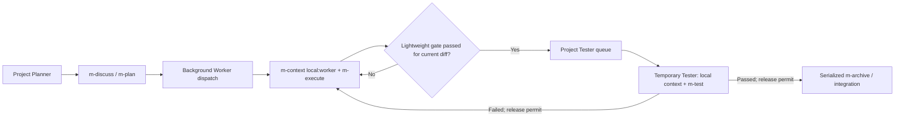

# Project-scoped m Orchestrator Plan

## Workflow Metadata

- Repository: `D:\project\my-ai-skills`
- Branch: `feat/project-orchestrator`
- Base: `main` at `36a5f3e6ed647614a9613419130890e07102c165`
- Project Root: `D:\project\my-ai-skills`
- Docs Root: `D:\project\my-ai-skills\worktrees\project-orchestrator\docs`
- Code Repositories: `D:\project\my-ai-skills`
- Active Worktree: `D:\project\my-ai-skills\worktrees\project-orchestrator`
- Plan Path: `D:\project\my-ai-skills\worktrees\project-orchestrator\plan.md`
- Current Stage: `3.2 - Implementation`
- Planning Status: confirmed by the user on 2026-07-31

## Discussion Summary

The confirmed direction is a project-level automation companion for the existing `m-*` skills. Each project has one persistent Planner session. An approved task is dispatched to a temporary background Worker, allowing the Planner to begin discussing the next task immediately. Workers use `$m-execute`, not `$m-go`, and may request a temporary Tester only after all applicable execution-stage lightweight checks pass.

Testers are admitted through a bounded per-project FIFO pool. A failed test releases the permit and returns structured evidence to the Worker for an `$m-execute` repair and complete gate rerun. A passed test enters serialized archive/integration admission. Projects on the same machine keep separate contexts, queues, environments, leases, and task state; an optional host budget shares only numerical capacity.

The new layer routes and schedules existing skills. It does not copy, weaken, or replace their phase behavior.

## Accepted Requirements

- One registered persistent Planner session per configured project.
- Non-blocking background Worker creation after plan approval.
- One isolated task branch/worktree and self-contained plan/context package per Worker.
- `$m-execute` as the normal Worker implementation authority.
- A hard lightweight gate before Tester admission, including applicable syntax/compile, type, focused lint/format, focused unit tests, conflict checks, and `git diff --check` evidence.
- Temporary Tester agents using `$m-test`, admitted through a configurable per-project pool.
- Permit release before repair, waiting, archive, or unrelated work.
- Automated failed-test return to the owning Worker, followed by execute repair, gate rerun, and requeue.
- Serialized per-project archive/integration admission.
- Explicit project identity, context mapping, environment namespace, and runtime isolation.
- Explicit `local:` loading for project role contexts under `<docs_root>/context`.
- Machine-readable configuration distinct from Markdown context.
- Optional machine-level numeric resource limits without project knowledge.
- Backward compatibility for all existing `m-*` commands.

## Rejected Requirements / Directions

- Use `$m-go` for every Worker: rejected because it imposes mandatory implementation delegation and owns only one plan's loop.
- Keep one permanent Tester: rejected because it binds stale context to unrelated worktrees and projects.
- Share one machine-wide test environment: rejected because environment and task isolation are project responsibilities.
- Parse scheduler settings from role Markdown: rejected because pool capacity, leases, and state transitions require deterministic validation.
- Allow automatic global context fallback: rejected because a missing project Tester environment must block rather than silently select unrelated context.

## Requirements Analysis

### Goal

Automate multi-task use of the existing `m-*` workflow so a project Planner remains conversationally available while approved tasks execute, test, converge, archive, and integrate in isolated background workflows.

### Scope

#### Must

- Add a canonical `$m-orchestrator` companion skill and package metadata.
- Define Planner, Worker, Tester, archive/integration, configuration, context, state, and host-tool contracts.
- Implement deterministic project configuration and runtime-state tooling with standard-library Python.
- Provide project-local Tester Pool queue/lease semantics and optional host-budget admission.
- Integrate discovery/routing into `$m-autoflow` without changing existing phase ownership.
- Add stable docs, focused tests, validation, distribution sync, and installed-copy parity checks.

#### Optional

- Provide a checked example/template configuration and role-context examples without creating project secrets.
- Expose concise status and queue inspection commands for the Planner.

#### Not In Scope

- A standalone GUI dashboard.
- Remote or multi-machine distributed scheduling.
- Encrypted secrets, environment provisioning engines, container orchestration, or CI replacement.
- Automatic docs publication, push, deployment, or remote creation.
- Permanent Tester identities or cross-project context sharing.

### Use Cases

1. A user discusses and approves Task A in Project A; its Worker starts in the background while the same Planner begins Task B discussion.
2. Two Project A Workers finish execution; only the configured number of Testers enter heavy testing and the rest remain in FIFO order.
3. A Worker has a syntax or unit failure; it remains in execution and never consumes a Tester permit.
4. A Tester fails an integration path; its permit is released, evidence returns to the Worker, and the repaired Task requeues only after the lightweight gate passes again.
5. Project A and Project B run on one machine with separate contexts, environments, Task state, and Tester pools while respecting an optional aggregate host limit.
6. A configured local Tester context is missing; the test transition blocks and does not fall back to a global context.
7. Two passing tasks reach integration together; archive/merge admission is serialized and later work reconciles with the current base before merge.

### Inputs / Outputs

Inputs:

- `.codex/m-orchestrator.toml` project configuration.
- Explicit `project_id`, docs root, code repositories, base branch, context mappings, pool settings, and environment namespace.
- Approved worktree-root `plan.md` / `todo.md` with Task IDs, write sets, acceptance, tests, and rollback.
- Existing `$m-context` Markdown files under `<docs_root>/context`.
- Codex project/thread tools and current task/thread identity when background dispatch is requested.

Outputs:

- Background Worker task identifiers and self-contained dispatch packages.
- Project-local task state, queue tickets, permits, heartbeat timestamps, failure signatures, and status summaries.
- Lightweight-gate evidence, Tester reports, archive readiness, and integration status.
- No copied plaintext context secrets in plans, reports, archives, logs, or final responses.

### Edge Cases

- Duplicate or invalid `project_id` within one Git common directory.
- Missing or malformed configuration and unsupported schema versions.
- Missing docs root or explicitly configured local context.
- A non-Git project, missing common directory, detached or conflicting worktree state.
- Host project/thread tools unavailable or background task creation fails.
- Worker creation succeeds but dispatch metadata cannot be persisted.
- Queue ticket duplication, capacity races, interrupted permit acquisition, and release retries.
- Expired heartbeat with an owning Worker whose live status is unknown.
- Test failure needing plan-external work or user-only environment authority.
- Base changes while a task waits for integration.
- Multiple logical projects inside one repository and identical Task IDs across projects.
- Machine budget unavailable after a project queue reaches its head.

### Acceptance Criteria

- Existing `m-*` skill behavior and focused tests remain passing.
- The orchestrator never runs implementation in the Planner task when background dispatch is requested.
- A Worker cannot enter Tester admission without a passing, current lightweight-gate record for the same change state.
- Project pool capacity is never exceeded under concurrent acquisition tests.
- FIFO order is preserved among eligible waiters within one project.
- Releasing or abandoning a lease is idempotent and does not release another Task's permit.
- Stale leases are reported for explicit recovery and are not silently reclaimed.
- Runtime paths differ across `project_id` values even inside one repository.
- Explicit local role contexts never fall back globally.
- A failed Tester returns to execution without retaining either project or host capacity.
- Merge/archive admission is capacity one per project.
- Validators, focused tests, full test discovery, sync, and source/dist/installed parity pass.

## Architecture Design

### Overall Solution

Add `m-orchestrator` as a companion control plane above a single-task `m-autoflow` lifecycle.

The skill owns orchestration decisions and routes each role to the existing authoritative skill after loading configured contexts. A standard-library helper owns deterministic configuration validation and local runtime coordination. Codex host tools own background project task creation and task messaging; the helper never attempts to reproduce host task APIs.

Planner-created task plans remain normal confirmed `m-plan` artifacts. On approval, the Planner persists the approved plan state and creates a project Worker task from the planned Git starting state. The Worker receives exact Task IDs, plan path/content reference, branch/base/worktree expectations, context names, pool identity, and callback/status metadata. The Worker materializes or confirms the worktree-root plan before `$m-execute`.

### Component Responsibilities

- `skills/m-orchestrator/SKILL.md`: trigger, role detection, main workflow, phase routing, tool gates, safety boundaries, and user-facing status.
- `references/configuration.md`: schema, discovery, explicit context mapping, project identity, and validation rules.
- `references/planner.md`: Planner registration, planning worktree/branch handoff, Worker task creation, non-blocking dispatch, and status inspection.
- `references/worker.md`: `$m-execute` invocation, lightweight gate, Tester admission, failure return, repair/requeue, and terminal handoff.
- `references/testing-pool.md`: per-project FIFO admission, optional host budget, leases, heartbeat, safe recovery, and release ordering.
- `references/state-machine.md`: Task states, allowed transitions, evidence invariants, and terminal/blocker conditions.
- `scripts/orchestrator_runtime.py`: configuration validation, project/runtime-root resolution, atomic tickets/leases, heartbeats, release, stale reporting, Task state compare-and-set, and status JSON.
- `assets/m-orchestrator.example.toml`: checked example without environment-specific values or credentials.
- Existing phase skills: remain the only authorities for discussion, planning, execution, testing, continuation, archive, and docs governance behavior.

### Data / Call Flow



### Configuration Interface Draft

```toml
schema_version = 1
project_id = "example-project"
docs_root = "docs"
base_branch = "main"

[commands.discuss]
skill = "m-discuss"
contexts = ["local:planner"]

[commands.plan]
skill = "m-plan"
contexts = ["local:planner"]

[commands.execute]
skill = "m-execute"
contexts = ["local:worker"]
require_lightweight_gate = true

[commands.test]
skill = "m-test"
contexts = ["local:tester"]
pool = "tester"

[commands.archive]
skill = "m-archive"
contexts = ["local:archive"]
pool = "merge"

[pools.tester]
capacity = 2
queue = "fifo"
lease_timeout_seconds = 3600

[pools.merge]
capacity = 1
queue = "fifo"
lease_timeout_seconds = 1800

[environment]
namespace = "example-project"
```

### Runtime Interface Draft

```text
orchestrator_runtime.py config validate --project-root <path>
orchestrator_runtime.py project status --project-root <path>
orchestrator_runtime.py task create --task-id <id> --plan <path>
orchestrator_runtime.py task transition --task-id <id> --from <state> --to <state> --evidence <path>
orchestrator_runtime.py pool enqueue --pool tester --task-id <id>
orchestrator_runtime.py pool try-acquire --pool tester --task-id <id>
orchestrator_runtime.py pool heartbeat --pool tester --task-id <id> --lease-id <id>
orchestrator_runtime.py pool release --pool tester --task-id <id> --lease-id <id>
orchestrator_runtime.py pool stale --pool tester
```

All mutating commands return structured JSON and use explicit compare-and-set inputs or owner identifiers. Invalid transitions, ownership mismatches, unsafe paths, malformed evidence, and configuration errors fail with non-zero status and actionable diagnostics.

### Runtime Storage

Project runtime state:

```text
<git-common-dir>/codex/m-orchestrator/projects/<project_id>/
├── project.json
├── planner.json
├── tasks/<task-id>.json
├── pools/<pool>/queue/
├── pools/<pool>/leases/
└── events/
```

Optional host budget state:

```text
<global-context-parent>/m-orchestrator/hosts/<host-id>/pools/<resource>/
```

The host path stores only numeric capacity, owner IDs, lease IDs, and timestamps. It stores no project context bodies, commands, secrets, environment settings, plans, diffs, or test output.

### Error Handling And Safety

- Validate configuration schema, exact project identity, capacity bounds, lease durations, relative docs paths, and context scope before dispatch.
- Reject `auto` or `global:` context mappings for required project environment roles unless the user explicitly configures a separate global default context in addition to the local project context.
- Use atomic directory/file creation for queue tickets and lease ownership.
- Require exact lease ID and Task owner for heartbeat and release.
- Report stale leases; require the orchestrator to inspect Worker status before an explicit reclaim.
- Release host capacity when project acquisition fails or any later acquisition step rolls back.
- Persist Task transition evidence before sending cross-thread messages, making delivery retryable.
- Never infer plan expansion, credentials, deployment authority, destructive cleanup, or environment access.

### Performance And Testing Strategy

- Keep status/list operations proportional to one project's Task and pool entries.
- Avoid busy loops: `try-acquire` is non-blocking; the Agent may retry on bounded host waits while continuing to report progress.
- Use standard-library unit tests with temporary Git repositories and isolated runtime roots.
- Exercise concurrent acquisition using multiple processes or threads and assert capacity and ownership invariants.
- Use contract tests for required skill routing, explicit local context, phase ownership, gate ordering, tool availability blockers, and package metadata.
- Run every affected skill validator, focused unit tests, full repository discovery, sync, parity checks, and `git diff --check`.

### Extensibility Design Points

- Additional pools such as browser, database, GPU, or device labs can reuse the same lease contract.
- Multiple logical projects may share one repository by using distinct `project_id` and environment namespaces.
- A future UI may consume status JSON without changing the runtime schema ownership.
- Remote scheduling may be added later behind a separate transport contract; v1 remains local-filesystem only.

## Docs Governance Routing Decision

- Docs root: `D:\project\my-ai-skills\worktrees\project-orchestrator\docs` during execution; canonical repository path is `D:\project\my-ai-skills\docs` after integration.
- Intake impact: add `docs/intake/2026-07-31_project-orchestrator.md` during planning.
- Feature impact: add `docs/features/m-project-orchestrator.md` and clarify `m-autoflow-workflow.md` during execution.
- Requirements impact: add `docs/requirements/m-project-orchestrator.md` and link from autoflow requirements during execution.
- Specs impact: add `docs/specs/m-project-orchestrator.md` and link from autoflow spec during execution.
- Decision impact: add `docs/decisions/2026-07-31_project-orchestrator.md` during planning.
- Lessons impact: none known; archive will reassess queue, Windows filesystem, and source/install parity lessons.

### Related Docs

- Intake: `docs/intake/2026-07-31_project-orchestrator.md`
- Feature: `docs/features/m-autoflow-workflow.md`
- Requirements: `docs/requirements/m-autoflow-skill.md`
- Specs: `docs/specs/m-autoflow-skill.md`
- Decisions: `docs/decisions/2026-07-09_m-go-automated-execution.md`, `docs/decisions/2026-07-17_m-continue-loop.md`, `docs/decisions/2026-07-31_project-orchestrator.md`
- Lessons: `docs/lessons/windows-skill-parity-line-endings.md`, `docs/lessons/python-unittest-discovery-nonpackage-tests.md`

## Executable Task List

### Will Execute After Approval

- ORCH-1
- ORCH-2
- ORCH-3
- ORCH-4
- ORCH-5
- ORCH-6

### Will Not Execute Now

- ORCH-X1: remote or multi-machine scheduler; deferred because v1 is explicitly local-machine orchestration.
- ORCH-X2: graphical project dashboard; deferred because status JSON and Codex task UI are sufficient for the first version.
- ORCH-X3: automatic test-environment provisioning; out of scope because project contexts describe environment operations and existing phase skills execute them.

## Task Details

### ORCH-1 - Add Stable Capability Documentation

- Owner: implementation agent
- Worktree: `D:\project\my-ai-skills\worktrees\project-orchestrator`
- Plan Path: `D:\project\my-ai-skills\worktrees\project-orchestrator\plan.md`
- Goal: establish current feature, durable requirements, technical contract, indexes, and cross-links for project orchestration.
- Files / Modules: `docs/features`, `docs/requirements`, `docs/specs`, affected README indexes, `docs/features/m-autoflow-workflow.md`, `docs/requirements/m-autoflow-skill.md`, `docs/specs/m-autoflow-skill.md`.
- Write Set: governed stable docs only.
- Acceptance: one canonical feature/requirement/spec chain exists; autoflow links the companion; no runtime truth is left only in intake or decision docs.
- Test Points: links resolve; indexes list new docs; terminology matches the accepted decision and plan.
- Rollback: remove new stable docs and revert only their index/cross-link additions.

### ORCH-2 - Add m-orchestrator Skill And Configuration Contract

- Owner: implementation agent
- Worktree: active worktree
- Plan Path: active `plan.md`
- Goal: add the companion skill, role references, example config, agent metadata, and manifest without duplicating phase instructions.
- Files / Modules: `skills/m-orchestrator/**`, `manifests/m-orchestrator.json`.
- Write Set: new skill package and manifest.
- Acceptance: skill routes each role to the authoritative existing skill, requires explicit local project contexts, blocks missing host tools/config, and documents project/host isolation.
- Test Points: skill validator; manifest dependency/reference assertions; no versioned plugin paths or embedded secrets.
- Rollback: remove the new package and manifest.

### ORCH-3 - Implement Project Runtime And Pool Helper

- Owner: implementation agent
- Worktree: active worktree
- Plan Path: active `plan.md`
- Goal: implement validated config loading, isolated runtime roots, Task state transitions, FIFO tickets, bounded leases, heartbeats, release, stale reporting, and optional host-budget admission.
- Files / Modules: `skills/m-orchestrator/scripts/orchestrator_runtime.py`, focused runtime test fixtures.
- Write Set: runtime helper and its directly owned fixtures.
- Acceptance: atomic capacity enforcement, owner-safe idempotent release, explicit transition validation, project isolation, and non-destructive stale handling.
- Test Points: invalid config; two project IDs; concurrent capacity; FIFO order; wrong-owner release; repeated release; heartbeat; stale report; host-budget rollback; path traversal.
- Rollback: remove helper and generated test fixtures; runtime data is outside versioned source and can be retained for diagnosis or explicitly removed later.

### ORCH-4 - Define Planner Dispatch And Worker/Test Convergence

- Owner: implementation agent
- Worktree: active worktree
- Plan Path: active `plan.md`
- Goal: define non-blocking project Worker dispatch, complete context packages, execute gate evidence, Tester admission, failure return, repair/requeue, and serialized archive integration.
- Files / Modules: `skills/m-orchestrator/SKILL.md`, `references/planner.md`, `references/worker.md`, `references/testing-pool.md`, `references/state-machine.md`.
- Write Set: orchestrator instruction and reference files.
- Acceptance: Planner never implements dispatched work; Worker uses `$m-execute`; current-diff gate is mandatory; Tester uses `$m-test`; failure releases capacity; archive remains `$m-archive` owned.
- Test Points: contract assertions for ordering, blocked states, exact context package fields, allowed transitions, permit lifetime, and merge serialization.
- Rollback: revert orchestration references while leaving existing phase skills unchanged.

### ORCH-5 - Integrate Umbrella Routing And Package Validation

- Owner: implementation agent
- Worktree: active worktree
- Plan Path: active `plan.md`
- Goal: expose the companion from `$m-autoflow`, update shared output routing where needed, and add focused contract/runtime tests.
- Files / Modules: `skills/m-autoflow/SKILL.md`, selected `skills/m-autoflow/references/*.md`, `tests/test_m_orchestrator_contract.py`, `tests/test_m_orchestrator_runtime.py`.
- Write Set: umbrella routing and orchestrator tests.
- Acceptance: orchestrator is discoverable as a companion rather than a phase; existing phase order is unchanged; tests guard all critical boundaries.
- Test Points: new focused tests plus existing m-context, m-continue, visual-output, and discuss contracts.
- Rollback: remove routing additions and focused tests without changing existing workflow behavior.

### ORCH-6 - Validate, Sync, Smoke-test, And Commit

- Owner: implementation agent
- Worktree: active worktree
- Plan Path: active `plan.md`
- Goal: validate final source, sync the new/affected skills, verify parity, exercise representative CLI flows, and create the required English commit(s).
- Files / Modules: generated ignored `dist/codex/m-orchestrator`, installed skill copy, Git history; source edits only for defects mapped back to ORCH-1 through ORCH-5.
- Write Set: validation artifacts, installed copy, and mapped fixes only.
- Acceptance: all validators and tests pass; source/dist/installed files match except build metadata and line endings; representative project isolation and Tester queue flow pass; `git diff --check` passes; commits follow repository style.
- Test Points: `tools/validate-skills.ps1`, focused unittest modules, full unittest discovery, `tools/sync-skills.ps1`, SHA-256/parity inspection, CLI smoke flow.
- Rollback: revert created commits and resync restored sources; do not remove unrelated installed skills or user context.

## Dependencies

- ORCH-1 and ORCH-2 may begin independently after approval.
- ORCH-3 depends on the ORCH-2 configuration contract.
- ORCH-4 depends on ORCH-2 and ORCH-3 interfaces.
- ORCH-5 depends on ORCH-2 through ORCH-4.
- ORCH-6 depends on all preceding tasks.

## Parallelism Assessment

- ORCH-1 stable docs and the initial ORCH-2 package skeleton have separate write sets and could be delegated in parallel if `$m-execute` authorizes delegation.
- ORCH-3 and ORCH-4 are coupled through configuration, state, and pool interfaces and should be sequenced unless ownership is split after the interfaces are frozen.
- ORCH-5 and ORCH-6 integrate broad shared files and should remain under one integrator.
- The requested execution mode is `$m-execute`, not `$m-go`; delegation is optional and must be reassessed at execution entry under host policy.

## Risks And Mitigations

- Host tool variability: gate background dispatch on actual project/thread tool availability and return an actionable blocker.
- Plan/worktree handoff drift: dispatch from a committed planned Git starting state and require the Worker to confirm the exact plan before execution.
- Cross-project leakage: require explicit `project_id`, explicit local contexts, isolated runtime roots, and namespaced environments.
- Lease races: use atomic filesystem ownership plus Task/lease IDs and concurrency tests.
- Stale lease false recovery: report stale candidates and require live-Worker inspection before reclaim.
- Resource deadlock: use non-blocking acquisition and release partial acquisitions before retry.
- Integration drift: serialize merges and rerun required checks after executable reconciliation.
- Secret leakage: never persist context bodies into runtime JSON, evidence, plans, logs, or archives.
- Prompt-contract regression: add exact focused tests for routing, gates, phase ownership, and package contents.

## Issue List

- No blocking issues.
- Project-specific pool sizes, context names, commands, lease timeouts, and namespaces are configuration values supplied when each target project adopts the orchestrator.

## Execution Progress

| Task ID | Status | Evidence |
| --- | --- | --- |
| ORCH-1 | Completed | dedicated feature, requirements, spec, indexes, and autoflow cross-links |
| ORCH-2 | Completed | `m-orchestrator` skill, five references, example TOML, agent metadata, and manifest |
| ORCH-3 | Completed | standard-library config, project state, Worker binding, FIFO queue, leases, heartbeat, stale reporting, and host budget runtime |
| ORCH-4 | Completed | Planner dispatch, Worker gate, temporary Tester, repair/requeue, and archive-admission contracts |
| ORCH-5 | Completed | autoflow companion routing plus contract and runtime test modules |
| ORCH-6 | Completed | 21 focused tests and 61 full tests passed with one existing privilege skip; source and installed validators passed; dist/install parity passed for both affected skills |

Execution-stage lightweight validation passed. Heavy independent review remains owned by `$m-test`; this execution phase does not create `docs/change`, merge, or clean the Worktree.

## Execution Scope After Approval

### Will Execute

- ORCH-1, ORCH-2, ORCH-3, ORCH-4, ORCH-5, ORCH-6

### Will Not Execute Now

- ORCH-X1: remote/multi-machine scheduling, deferred.
- ORCH-X2: graphical dashboard, deferred.
- ORCH-X3: test-environment provisioning engine, out of scope.

## Approval Gate

Blocked: no

Enter execution for ORCH-1 through ORCH-6.

Implementation sub-agents were not dispatched because the active host requires explicit delegation authorization for ordinary `$m-execute`; the main execution Agent retains integration responsibility.
